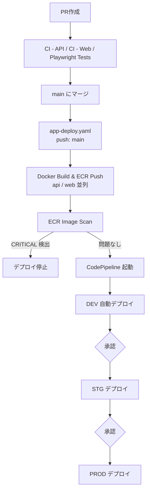
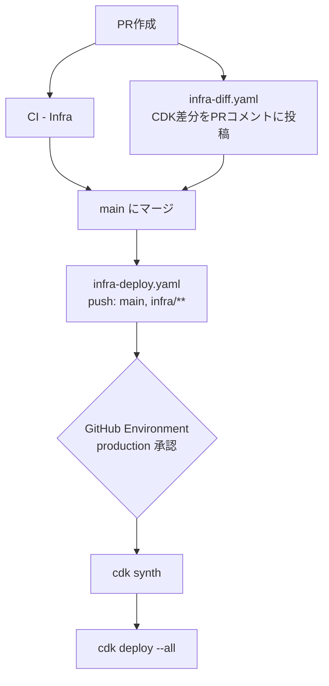

# Deploy

## アプリデプロイの流れ



---

## インフラデプロイの流れ



---

## アプリデプロイ (`.github/disabled-workflows/app-deploy.yaml`)

### 概要

`main` ブランチへの push（PR マージ）で `apps/api/**`・`apps/web/**`・`packages/**`・`pnpm-lock.yaml` に変更があった場合に起動するワークフロー。ブランチ保護ルールにより CI 通過済みであることが保証された状態で Docker イメージをビルドして DEV 環境の ECR へ push する。push が CodePipeline のトリガーとなり、DEV→STG→PROD の昇格パイプラインが起動する。

CI 通過の保証はワークフロー内ではなく GitHub の **Required status checks**（ブランチ保護ルール）で行う。同一コミットに対する重複実行は `concurrency` グループ（`app-deploy-<sha>`）でキャンセルされる。

### 処理フロー

```
build-push-scan (api)
build-push-scan (web)  ← 並列実行
```

### ジョブ一覧

| ジョブ | 内容 |
|---|---|
| `build-push-scan` | OIDC 認証 → Docker ビルド → ECR push → スキャン結果確認（api / web の matrix） |

### ECR push とスキャンゲート

- `:${GITHUB_SHA}` と `:latest` の 2 タグを push する
- `imageScanOnPush: true` のためプッシュ直後にスキャンが実行される
- `CRITICAL` 脆弱性が 1 件でも検出された場合はワークフローが失敗し、パイプラインは起動しない

### 必要な GitHub Secrets / Variables

| 名前 | 種別 | 説明 |
|---|---|---|
| `AWS_APP_DEPLOY_ROLE_ARN` | Secret | OIDC ロール ARN（ECR push 専用、ECS/CodePipeline 操作不可） |
| `AWS_REGION` | Variable | AWS リージョン（例: `ap-northeast-1`） |

---

## インフラデプロイ (`.github/disabled-workflows/infra-deploy.yaml`)

### 概要

`main` ブランチへの push（PR マージ）で `infra/**` に変更があった場合に起動するワークフロー。GitHub Environment（`production`）の承認ゲートを経てから OIDC 認証で AWS に接続し、CDK スタックを自動デプロイする。

CodePipeline + CodeStar Connections を使わず GitHub Actions + OIDC に統一することで、すべての CI/CD をコードで管理し手動セットアップを排除している。

### 処理フロー

1. AWS OIDC 認証（`production` Environment にスコープされた IAM ロール）
2. `npx cdk synth --no-notices`
3. `npx cdk deploy --all --require-approval never --no-notices`

### 承認ゲート

GitHub Environment `production` に以下を設定することで、デプロイ前の手動承認と実行ブランチの制限を行う。

| 設定 | 値 |
|---|---|
| Required reviewers | 承認者を指定 |
| Deployment branches | `main` のみ |

### OIDC トラストポリシー

IAM ロールのトラストポリシーは Environment に紐づけることで、`main` ブランチ以外・`production` Environment 以外からの Assume を AWS 側でもブロックする。

```json
"StringEquals": {
  "token.actions.githubusercontent.com:sub": "repo:<org>/<repo>:environment:production"
}
```

### 必要な GitHub Secrets / Variables

| 名前 | 種別 | 説明 |
|---|---|---|
| `AWS_INFRA_DEPLOY_ROLE_ARN` | Secret | OIDC ロール ARN（CDK deploy 用） |
| `AWS_REGION` | Variable | AWS リージョン |

---

## アプリパイプライン（CodePipeline: `ApiAppPipeline` / `WebAppPipeline`）

### 概要

ECR の `:latest` タグ更新を EventBridge で検知して起動するパイプライン。DEV への自動デプロイ後、承認を経て STG・PROD へ順番にイメージを昇格させる。

### 昇格モデル

```
ECR forge-ts/api-dev:latest push
  └─ DEV 自動デプロイ（Blue/Green, LINEAR_10PERCENT_EVERY_1MINUTES）
       └─ 承認（enableStg 時）
            └─ forge-ts/api-stg:latest へ昇格（同一イメージダイジェスト）
                 └─ STG 自動デプロイ
                      └─ 承認（enableProd 時）
                           └─ forge-ts/api-prod:latest へ昇格
                                └─ PROD 自動デプロイ
```

昇格はイメージの**再ビルドなし**でマニフェストをコピーするため、DEV で検証済のバイナリがそのまま PROD に届く。

### ステージ構成

| ステージ | 常時 | enableStg | enableProd |
|---|---|---|---|
| Source | ✓ | ✓ | ✓ |
| GenerateDev | ✓ | ✓ | ✓ |
| DeployDev | ✓ | ✓ | ✓ |
| ApproveStg | | ✓ | ✓ |
| PromoteToStg | | ✓ | ✓ |
| GenerateStg | | ✓ | ✓ |
| DeployStg | | ✓ | ✓ |
| ApproveProd | | | ✓ |
| PromoteToProd | | | ✓ |
| GenerateProd | | | ✓ |
| DeployProd | | | ✓ |

### デプロイ設定

| 設定 | 値 |
|---|---|
| デプロイ戦略 | `LINEAR_10PERCENT_EVERY_1MINUTES`（段階的トラフィック移行） |
| 失敗時 | 自動ロールバック |
| 旧タスク削除 | デプロイ成功直後に自動削除 |
| ALB リスナー | 本番用 :80 / テスト用 :8080 |
