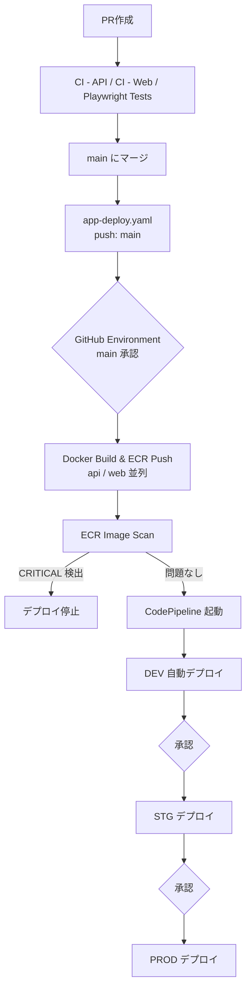
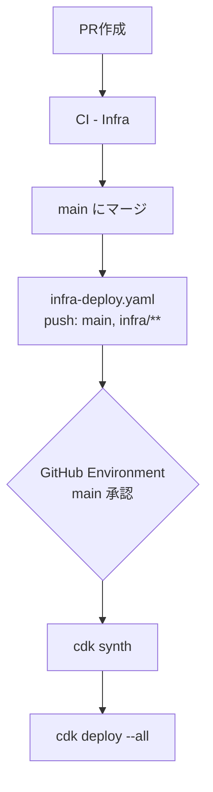

# Deploy

## 事前準備（GitHub / AWS 設定）

`app-deploy.yaml` / `infra-deploy.yaml` を有効化する前に、以下がすべて設定されている必要がある。特に **GitHub Environment の設定を忘れると、承認なしで無人デプロイされてしまう**ため注意。

### 1. GitHub Environment: `main`

Settings → Environments → New environment → `main`

| 設定 | 値 | 必須度 |
|---|---|---|
| Required reviewers | 承認者を指定 | 必須（未設定だと承認ゲートが機能せず、pushされた瞬間に無人でデプロイされる） |
| Deployment branches | `main` のみ | 推奨 |

`app-deploy.yaml`（`approve` ジョブ）・`infra-deploy.yaml`（`cdk-deploy` ジョブ）の両方がこの Environment を参照する。IAM ロールのトラストポリシーもこの Environment 名にスコープされているため、設定を怠ると GitHub 側・AWS 側どちらの防御も効かない。

### 2. GitHub Secrets

Settings → Secrets and variables → Actions → Secrets

| 名前 | 使用ワークフロー | 説明 |
|---|---|---|
| `AWS_APP_DEPLOY_ROLE_ARN` | `app-deploy.yaml` | OIDC ロール ARN（DEV ECR push 専用、ECS/CodePipeline 操作不可） |
| `AWS_INFRA_DEPLOY_ROLE_ARN` | `infra-deploy.yaml` | OIDC ロール ARN（CDK deploy 用） |
| `E2E_USERNAME` / `E2E_PASSWORD` | `e2e.yaml` | E2E テスト用アカウント（必須。詳細は [ci.md](./ci.md)） |
| `JWT_SECRET` / `AUTH_SECRET` | `e2e.yaml` | 任意。未設定時はワークフロー内の固定値で代替 |

上記2つの OIDC ロールは **CDK（`PipelineStack`）自身が作成する** 。ローカルの強い権限を持つ AWS 認証情報で一度 `cdk deploy --all` を実行し、出力されたロール ARN をここに設定する（初回セットアップの全手順は [README.md](../README.md) を参照）。

### 3. GitHub Variables

Settings → Secrets and variables → Actions → Variables

| 名前 | 使用ワークフロー | 説明 |
|---|---|---|
| `AWS_REGION` | 全ワークフロー | 例: `ap-northeast-1` |
| `POSTGRES_DB` | `infra-deploy.yaml` | RDS のデータベース名（`cdk synth`/`deploy` の実行に必須。未設定だとエラーで停止する） |

### 4. ブランチ保護ルール（`main`）

Settings → Branches → Branch protection rules

| 設定 | 値 |
|---|---|
| Require status checks to pass before merging | `CI - API` / `CI - Web` / `CI - Infra` 等を必須化 |
| Require a pull request before merging | 推奨（`main` への直接 push を防ぐ） |

`app-deploy.yaml` はワークフロー内で CI 通過を検証していない（コメントで前提としているだけ）ため、この設定が実質的な担保になる。

---

## アプリデプロイの流れ



`app-deploy.yaml` と `infra-deploy.yaml` は `concurrency` グループ（`infra-app-deploy-lock`）を共有しており、片方の実行中はもう片方が待機する（CDKによるインフラ更新とアプリのビルド・ECS Blue/Greenデプロイが同時に走ることで生じ得る不整合を防ぐため）。

---

## インフラデプロイの流れ



---

## アプリデプロイ (`.github/workflows/app-deploy.yaml`)

### 概要

`main` ブランチへの push（PR マージ）で `apps/api/**`・`apps/web/**`・`packages/**`・`pnpm-lock.yaml` に変更があった場合に起動するワークフロー。ブランチ保護ルールにより CI 通過済みであることが保証された状態で Docker イメージをビルドして DEV 環境の ECR へ push する。push が CodePipeline のトリガーとなり、DEV→STG→PROD の昇格パイプラインが起動する。

CI 通過の保証はワークフロー内ではなく GitHub の **Required status checks**（ブランチ保護ルール）で行う。`infra-deploy.yaml` と `concurrency` グループ（`infra-app-deploy-lock`）を共有しており、CDKによるインフラ更新中はキャンセルされず待機する。

### 処理フロー

```
approve（GitHub Environment main 承認）
  └─ build-push-scan (api)
     build-push-scan (web)  ← 並列実行
```

### ジョブ一覧

| ジョブ | 内容 |
|---|---|
| `approve` | GitHub Environment `main` の承認ゲート（`infra-deploy.yaml` と同様） |
| `build-push-scan` | `approve` 完了後、OIDC 認証 → Docker ビルド → ECR push → スキャン結果確認（api / web の matrix） |

### ECR push とスキャンゲート

- `:${GITHUB_SHA}` と `:latest` の 2 タグを push する
- `imageScanOnPush: true` のためプッシュ直後にスキャンが実行される
- `CRITICAL` 脆弱性が 1 件でも検出された場合はワークフローが失敗し、パイプラインは起動しない

### 必要な GitHub Secrets / Variables

| 名前 | 種別 | 説明 |
|---|---|---|
| `AWS_APP_DEPLOY_ROLE_ARN` | Secret | OIDC ロール ARN（ECR push 専用、ECS/CodePipeline 操作不可） |
| `AWS_REGION` | Variable | AWS リージョン（例: `ap-northeast-1`） |

---

## インフラデプロイ (`.github/workflows/infra-deploy.yaml`)

### 概要

`main` ブランチへの push（PR マージ）で `infra/**` に変更があった場合に起動するワークフロー。GitHub Environment（`main`）の承認ゲートを経てから OIDC 認証で AWS に接続し、CDK スタックを自動デプロイする。`app-deploy.yaml` と `concurrency` グループ（`infra-app-deploy-lock`）を共有しており、アプリのビルド・デプロイ中はキャンセルされず待機する。

CodePipeline + CodeStar Connections を使わず GitHub Actions + OIDC に統一することで、すべての CI/CD をコードで管理し手動セットアップを排除している。

### 処理フロー

1. AWS OIDC 認証（`main` Environment にスコープされた IAM ロール）
2. `npx cdk synth --no-notices`
3. `npx cdk deploy --all --require-approval never --no-notices`

### 承認ゲート

GitHub Environment `main` に以下を設定することで、デプロイ前の手動承認と実行ブランチの制限を行う。

| 設定 | 値 |
|---|---|
| Required reviewers | 承認者を指定 |
| Deployment branches | `main` のみ |

### OIDC トラストポリシー

IAM ロールのトラストポリシーは Environment（`main`）に紐づけることで、この Environment を経由しない Assume を AWS 側でもブロックする。

```json
"StringEquals": {
  "token.actions.githubusercontent.com:sub": "repo:<org>/<repo>:environment:main"
}
```

### 必要な GitHub Secrets / Variables

| 名前 | 種別 | 説明 |
|---|---|---|
| `AWS_INFRA_DEPLOY_ROLE_ARN` | Secret | OIDC ロール ARN（CDK deploy 用） |
| `AWS_REGION` | Variable | AWS リージョン |

---

## マニュアルアプリデプロイ手順

CDK デプロイ直後や GitHub Actions ワークフローを使用せずに手動でアプリをデプロイする場合の手順。

### 前提条件

- AWS CLI がインストール・設定済みであること
- Docker がインストール・起動済みであること
- 以下の IAM 権限を持つ AWS 認証情報が設定済みであること
  - `ecr:GetAuthorizationToken`
  - `ecr:BatchCheckLayerAvailability`, `ecr:InitiateLayerUpload`, `ecr:UploadLayerPart`, `ecr:CompleteLayerUpload`, `ecr:PutImage`（`forge-ts/api-dev` / `forge-ts/web-dev` リポジトリ）
  - `ecr:DescribeImageScanFindings`, `ecr:DescribeImages`（スキャン結果確認用）

### 1. 環境変数の設定

`.env.template` をコピーして値を設定後、読み込む。

```bash
cp .env.template .env
# .env を編集して AWS_REGION, AWS_ACCOUNT_ID, IMAGE_TAG を設定
set -a && source .env && set +a
```

`REGISTRY` はシェル上で動的に組み立てる。

```bash
export REGISTRY=$AWS_ACCOUNT_ID.dkr.ecr.$AWS_REGION.amazonaws.com
```

### 2. ECR ログイン

```bash
aws ecr get-login-password --region $AWS_REGION | \
  docker login --username AWS --password-stdin $REGISTRY
```

### 3. API イメージのビルド & プッシュ

ビルドコンテキストはモノレポルート（`apps/api/Dockerfile` を参照）。

```bash
docker build \
  --platform linux/arm64 \
  -t $REGISTRY/forge-ts/api-dev:$IMAGE_TAG \
  -f apps/api/Dockerfile \
  .

docker push $REGISTRY/forge-ts/api-dev:$IMAGE_TAG
```

### 4. Web イメージのビルド & プッシュ

```bash
docker build \
  --platform linux/arm64 \
  -t $REGISTRY/forge-ts/web-dev:$IMAGE_TAG \
  -f apps/web/Dockerfile \
  .

docker push $REGISTRY/forge-ts/web-dev:$IMAGE_TAG
```

### 5. ECR スキャン結果の確認

CRITICAL 脆弱性が検出された場合は `:latest` タグのプッシュを行わず、脆弱性を修正してから再ビルドする。

```bash
for REPO in forge-ts/api-dev forge-ts/web-dev; do
  echo "=== $REPO ==="
  aws ecr wait image-scan-complete \
    --repository-name "$REPO" \
    --image-id "imageTag=$IMAGE_TAG" \
    --region "$AWS_REGION"

  aws ecr describe-image-scan-findings \
    --repository-name "$REPO" \
    --image-id "imageTag=$IMAGE_TAG" \
    --region "$AWS_REGION" \
    --query 'imageScanFindings.findingSeverityCounts' \
    --output table
done
```

### 6. `:latest` タグでプッシュ（CodePipeline トリガー）

CRITICAL 脆弱性がないことを確認後、`:latest` タグをプッシュする。このプッシュが EventBridge 経由で `ApiAppPipeline` / `WebAppPipeline` を起動する。

```bash
# API
docker tag $REGISTRY/forge-ts/api-dev:$IMAGE_TAG $REGISTRY/forge-ts/api-dev:latest
docker push $REGISTRY/forge-ts/api-dev:latest

# Web
docker tag $REGISTRY/forge-ts/web-dev:$IMAGE_TAG $REGISTRY/forge-ts/web-dev:latest
docker push $REGISTRY/forge-ts/web-dev:latest
```

## アプリパイプライン（CodePipeline: `ApiAppPipeline` / `WebAppPipeline`）

### 概要

ECR の `:latest` タグ更新を EventBridge で検知して起動するパイプライン。DEV への自動デプロイ後、承認を経て STG・PROD へ順番にイメージを昇格させる。

### 昇格モデル

```
ECR forge-ts/api-dev:latest push
  └─ DEV 自動デプロイ（Blue/Green, LINEAR_10PERCENT_EVERY_1MINUTES）
       └─ 承認（enableStg 時）
            └─ forge-ts/api-stg:latest へ昇格（同一イメージダイジェスト）
                 └─ STG 自動デプロイ
                      └─ 承認（enableProd 時）
                           └─ forge-ts/api-prod:latest へ昇格
                                └─ PROD 自動デプロイ
```

昇格はイメージの**再ビルドなし**でマニフェストをコピーするため、DEV で検証済のバイナリがそのまま PROD に届く。

### ステージ構成

| ステージ | 常時 | enableStg | enableProd |
|---|---|---|---|
| Source | ✓ | ✓ | ✓ |
| GenerateDev | ✓ | ✓ | ✓ |
| DeployDev | ✓ | ✓ | ✓ |
| ApproveStg | | ✓ | ✓ |
| PromoteToStg | | ✓ | ✓ |
| GenerateStg | | ✓ | ✓ |
| DeployStg | | ✓ | ✓ |
| ApproveProd | | | ✓ |
| PromoteToProd | | | ✓ |
| GenerateProd | | | ✓ |
| DeployProd | | | ✓ |

### デプロイ設定

| 設定 | 値 |
|---|---|
| デプロイ戦略 | `LINEAR_10PERCENT_EVERY_1MINUTES`（段階的トラフィック移行） |
| 失敗時 | 自動ロールバック |
| 旧タスク削除 | デプロイ成功直後に自動削除 |
| ALB リスナー | 本番用 :80 / テスト用 :8080 |
