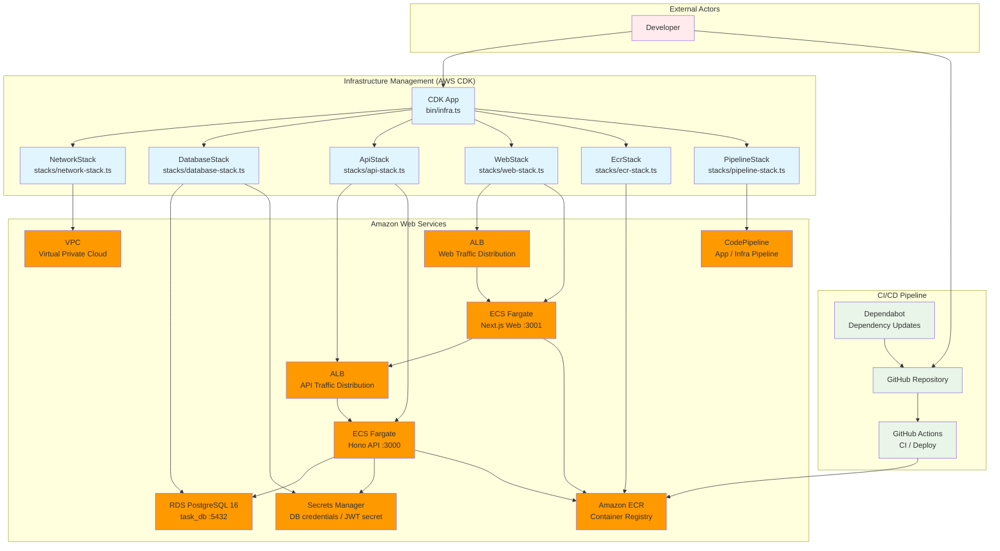
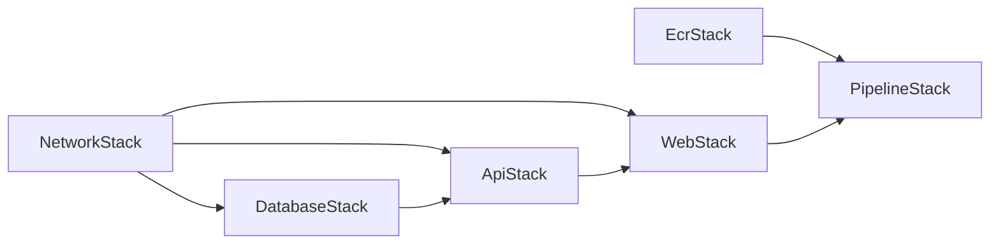
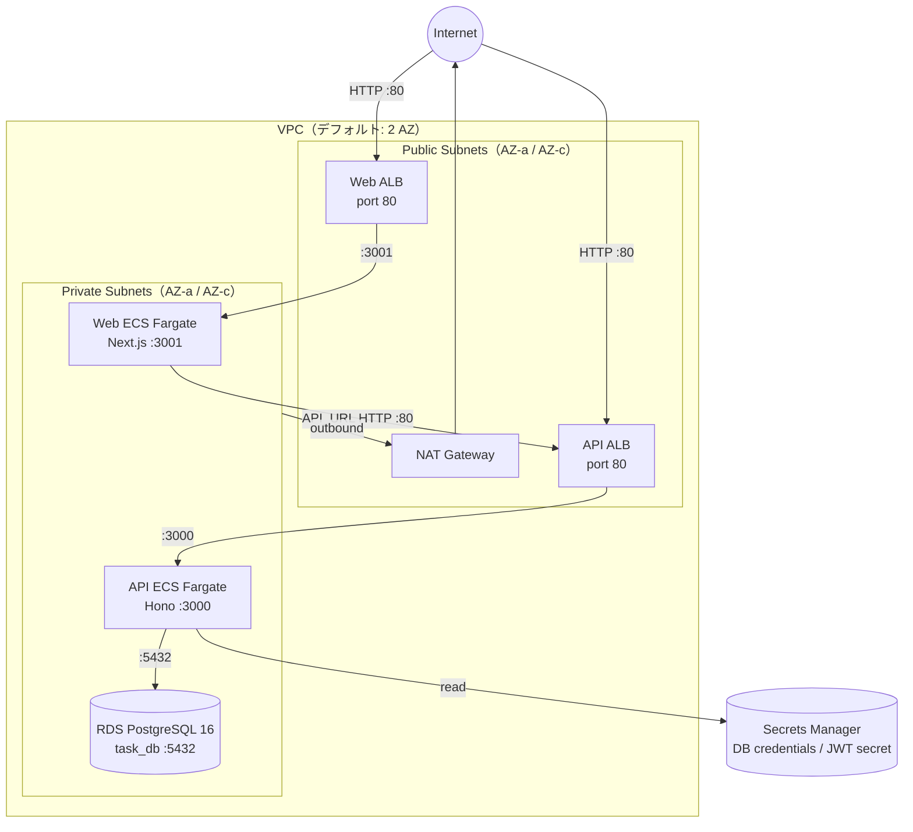
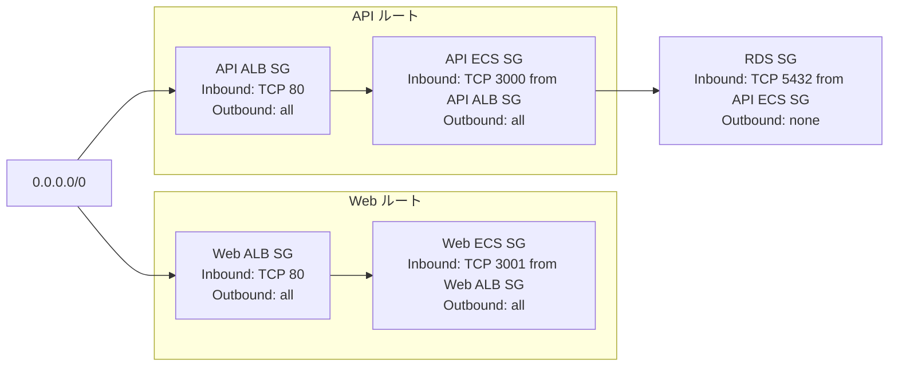
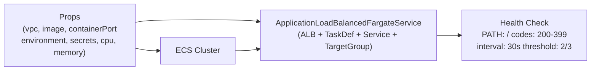

# インフラアーキテクチャ

AWS CDK (TypeScript) で定義されている。グローバルスタック 2 つ（`EcrStack`・`PipelineStack`）と、環境ごとのスタック 4 つ（`NetworkStack`・`DatabaseStack`・`ApiStack`・`WebStack`）で構成される。DEV 環境は常に作成され、STG・PROD は CDK コンテキスト（`enableStg` / `enableProd`）で有効化する。

## システム概要



---

## スタック依存関係



| スタック | ファイル | スコープ | 役割 |
|---|---|---|---|
| `EcrStack` | `lib/stacks/ecr-stack.ts` | グローバル | ECR リポジトリ（api / web × 環境） |
| `PipelineStack` | `lib/stacks/pipeline-stack.ts` | グローバル | CodePipeline（アプリ・インフラデプロイ）※GitHub Actions へ移行予定 |
| `NetworkStack` | `lib/stacks/network-stack.ts` | 環境ごと | VPC・サブネット・セキュリティグループ |
| `DatabaseStack` | `lib/stacks/database-stack.ts` | 環境ごと | RDS PostgreSQL・DB 認証情報 |
| `ApiStack` | `lib/stacks/api-stack.ts` | 環境ごと | Hono API サーバー (ECS Fargate) |
| `WebStack` | `lib/stacks/web-stack.ts` | 環境ごと | Next.js フロントエンド (ECS Fargate) |

---

## アーキテクチャ全体図



---

## セキュリティグループ

ALB・ECS のセキュリティグループは `ApplicationLoadBalancedFargateService` パターンが自動生成する。
RDS セキュリティグループは `NetworkStack` で定義し、`ApiStack` 内で `CfnSecurityGroupIngress` を使って API ECS SG からのインバウンドルールを追加している。



---

## スタック詳細

### EcrStack

環境ごとに api / web の ECR リポジトリペアを管理するグローバルスタック。DEV は常に作成され、STG・PROD はコンテキストフラグで制御する。

| 項目 | 値 |
|---|---|
| リポジトリ名 | `forge-ts/api-{env}` / `forge-ts/web-{env}` |
| イメージスキャン | プッシュ時に自動実行（`imageScanOnPush: true`） |
| ライフサイクルルール | 最新 20 イメージのみ保持 |
| 削除ポリシー | `RETAIN`（スタック削除時もリポジトリは残る） |

| 環境 | 有効化条件 |
|---|---|
| DEV | 常時 |
| STG | `enableStg: true` |
| PROD | `enableProd: true` |

### PipelineStack

> **移行予定**: CodePipeline + CodeStar Connections から GitHub Actions + OIDC へ移行予定。詳細は [deploy.md](./deploy.md) を参照。

アプリ・インフラのデプロイパイプラインを管理するグローバルスタック。CodeStar Connections 経由で GitHub を Source とし、ECS Blue/Green デプロイと CDK デプロイを実行する。

### NetworkStack

- **VPC**: パブリック・プライベートサブネット各 AZ、NAT Gateway 1 台
- セキュリティグループを 3 つ定義し、下位スタックへ渡す

| セキュリティグループ | インバウンド | アウトバウンド |
|---|---|---|
| `albSecurityGroup` | TCP 80, 443 (0.0.0.0/0) | all |
| `ecsSecurityGroup` | TCP 3000 from ALB SG | all |
| `rdsSecurityGroup` | TCP 5432 from ECS SG | なし |

> `albSecurityGroup` / `ecsSecurityGroup` は現在 NetworkStack のみで定義されており、各スタックの ECS サービスには `ApplicationLoadBalancedFargateService` が自動生成した SG が適用される。`rdsSecurityGroup` は DatabaseStack・ApiStack に渡され実際に使われる。

### DatabaseStack

- RDS PostgreSQL 16 をプライベートサブネットに配置
- DB 認証情報は Secrets Manager (`DatabaseSecret`) に自動保存
- `rdsSecurityGroup` を RDS インスタンスに適用

| 項目 | 値 |
|---|---|
| DB 名 | `task_db` |
| ユーザー | `postgres` |
| ストレージ | 20 GB（最大 100 GB まで自動スケール） |
| Multi-AZ | 無効 |

### ApiStack

- `EcsFargateService` コンストラクト（`lib/constructs/ecs-fargate-service.ts`）を利用して ALB + Fargate を構築
- RDS 接続情報と JWT シークレットを Secrets Manager から起動時に注入
- `CfnSecurityGroupIngress` で API ECS SG → RDS SG (:5432) のインバウンドルールを追加
- タスクロールに DB 認証情報・JWT シークレットの `secretsmanager:GetSecretValue` を付与

```
環境変数: DB_HOST, DB_PORT, DB_NAME, NODE_ENV
シークレット: DB_USERNAME, DB_PASSWORD (DatabaseSecret), JWT_SECRET (jwt-secret)
```

### WebStack

- `EcsFargateService` コンストラクトを利用して ALB + Fargate を構築
- `API_URL` には ApiStack の ALB DNS 名を渡す（デプロイ時に動的解決）

```
環境変数: API_URL (http://<API ALB DNS>), NODE_ENV
```

---

## 再利用コンストラクト: EcsFargateService

`lib/constructs/ecs-fargate-service.ts` — ApiStack・WebStack で共通利用する ALB + ECS Fargate のパターン。



---

## 設定パラメータ

デプロイ時に環境変数で調整できる。

| 環境変数 | デフォルト | 説明 |
|---|---|---|
| `MAX_AZS` | `2` | 使用する AZ 数 |
| `DB_INSTANCE_TYPE` | `t3.micro` | RDS インスタンスタイプ |
| `DB_ALLOCATED_STORAGE` | `20` | 初期ストレージ (GB) |
| `DB_MAX_ALLOCATED_STORAGE` | `100` | 自動スケール上限 (GB) |
| `API_CPU` | `256` | API タスクの CPU ユニット |
| `API_MEMORY_MIB` | `512` | API タスクのメモリ (MiB) |
| `API_DESIRED_COUNT` | `1` | API タスクの起動数 |
| `WEB_CPU` | `256` | Web タスクの CPU ユニット |
| `WEB_MEMORY_MIB` | `512` | Web タスクのメモリ (MiB) |
| `WEB_DESIRED_COUNT` | `1` | Web タスクの起動数 |
