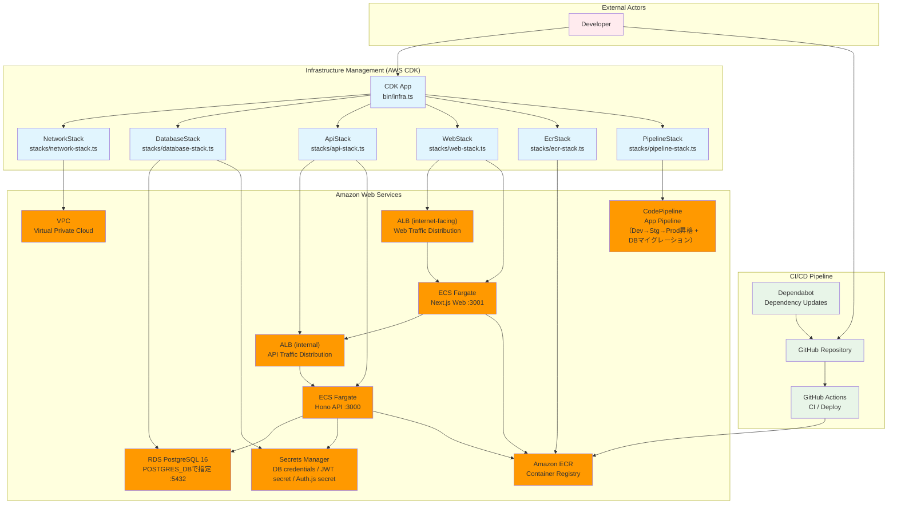
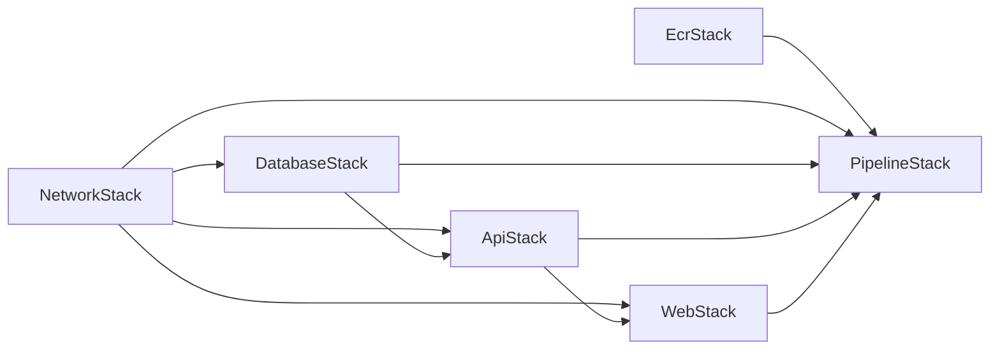
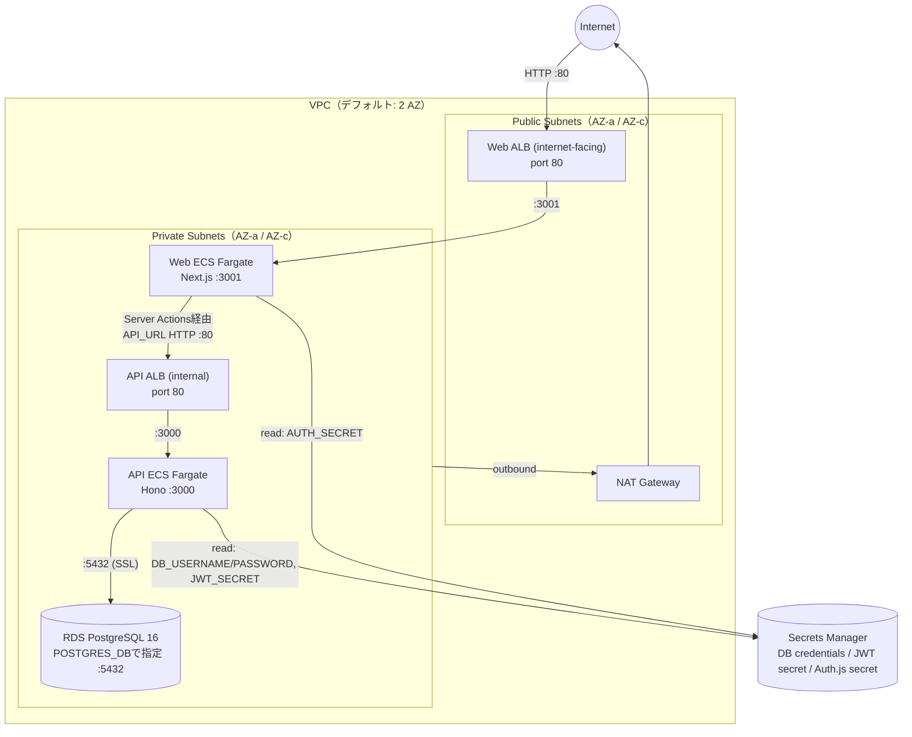
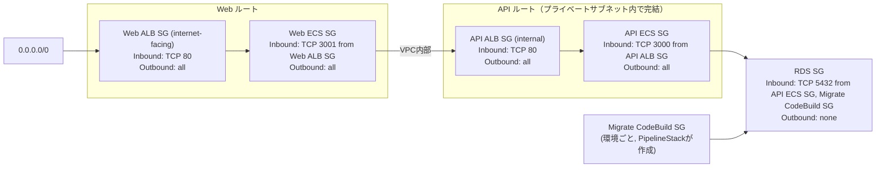
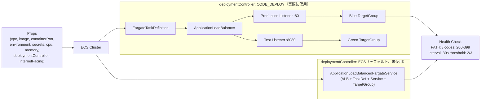

# インフラアーキテクチャ

AWS CDK (TypeScript) で定義されている。グローバルスタック 2 つ（`EcrStack`・`PipelineStack`）と、環境ごとのスタック 4 つ（`NetworkStack`・`DatabaseStack`・`ApiStack`・`WebStack`）で構成される。DEV 環境は常に作成され、STG・PROD は CDK コンテキスト（`enableStg` / `enableProd`）で有効化する。

## システム概要



---

## スタック依存関係



`PipelineStack`は、Blue/GreenデプロイのためのTargetGroup/Listener（ApiStack・WebStack由来）に加えて、Prismaマイグレーション用CodeBuildをRDSと同じVPCに配置するため`NetworkStack`（vpc・rdsSecurityGroup）・`DatabaseStack`（RDSインスタンス・認証情報）にも依存する。

| スタック | ファイル | スコープ | 役割 |
|---|---|---|---|
| `EcrStack` | `lib/stacks/ecr-stack.ts` | グローバル | ECR リポジトリ（api / web × 環境） |
| `PipelineStack` | `lib/stacks/pipeline-stack.ts` | グローバル | GitHub Actions用OIDCロール + アプリCodePipeline（Blue/Greenデプロイ・DBマイグレーション） |
| `NetworkStack` | `lib/stacks/network-stack.ts` | 環境ごと | VPC・サブネット・セキュリティグループ |
| `DatabaseStack` | `lib/stacks/database-stack.ts` | 環境ごと | RDS PostgreSQL・DB 認証情報 |
| `ApiStack` | `lib/stacks/api-stack.ts` | 環境ごと | Hono API サーバー (ECS Fargate、内部ALB) |
| `WebStack` | `lib/stacks/web-stack.ts` | 環境ごと | Next.js フロントエンド (ECS Fargate、公開ALB) |

---

## アーキテクチャ全体図



ブラウザは常にWeb ALBのみと通信する（Next.jsのServer Actions + Honoの型付きRPCクライアントによるBFF構成）。API ALBはブラウザから直接到達できない内部ALBで、Webタスクからのみアクセスされる。

---

## セキュリティグループ

ALB・ECS のセキュリティグループは `EcsFargateService` コンストラクトが自動生成する（`internetFacing: false` の場合、API ALBはプライベートサブネットに配置されるためインターネットから到達不可）。
RDS セキュリティグループは `NetworkStack` で定義し、`ApiStack` 内で `CfnSecurityGroupIngress` を使って API ECS SG からのインバウンドルールを追加している。加えて、`PipelineStack` がPrismaマイグレーション用CodeBuild（環境ごとに専用SG）からのインバウンドルールも同様のパターンで追加している。



---

## スタック詳細

### EcrStack

環境ごとに api / web の ECR リポジトリペアを管理するグローバルスタック。DEV は常に作成され、STG・PROD はコンテキストフラグで制御する。

| 項目 | 値 |
|---|---|
| リポジトリ名 | `forge-ts/api-{env}` / `forge-ts/web-{env}` |
| イメージスキャン | プッシュ時に自動実行（`imageScanOnPush: true`） |
| ライフサイクルルール | 最新 20 イメージのみ保持 |
| 削除ポリシー | `RETAIN`（スタック削除時もリポジトリは残る） |

| 環境 | 有効化条件 |
|---|---|
| DEV | 常時 |
| STG | `enableStg: true` |
| PROD | `enableProd: true` |

### PipelineStack

グローバルスタック。役割は大きく2つ。

1. **GitHub Actions用のOIDCロール**（IAMのみ、CodePipelineとは無関係）
   | ロール | 用途 | スコープ |
   |---|---|---|
   | `github-actions-app-deploy` | DEV ECRへのイメージpush専用 | `refs/heads/main` |
   | `github-actions-infra-diff` | `cdk synth`/`diff`（読み取りのみ） | 任意のref |
   | `github-actions-infra-deploy` | `cdk deploy`（`production` Environment承認必須） | GitHub Environment `production` |

   CodeStar Connectionsは使用していない。GitHubからのソース取得はGitHub Actions側（`.github/workflows/`、現状`disabled-workflows/`配下）が担当し、CDKはOIDC経由でAssumeRoleするのみ。詳細は [deploy.md](./deploy.md) を参照。

2. **アプリ用CodePipeline**（`ApiAppPipeline` / `WebAppPipeline`）
   - **Source**: GitHubではなく、DEV ECRリポジトリへの`:latest`イメージpushをEventBridge経由で検知して起動（`EcrSourceAction`）
   - **Generate → (Migrate) → Deploy** の順にステージが並ぶ。`Migrate*`（`MigrateDev`/`MigrateStg`/`MigrateProd`）は`ApiAppPipeline`のみに存在し、VPC内に配置したCodeBuildで`prisma migrate deploy`を実行してからBlue/Greenデプロイに進む
   - `Generate*`ステージは、ECSサービスが現在使用中のタスク定義ではなく、**`cdk deploy`のたびに最新化されるCloudFormation側のタスク定義ARN**を起点にコンテナイメージだけを差し替える（`CODE_DEPLOY`コントローラーのECSサービスはタスク定義の更新をCloudFormationだけでは反映しないため）
   - DEV→STG→PRODの昇格は再ビルドではなくECRイメージダイジェストのコピー（`buildPromoteProject`）。承認ゲートは`ApproveStg`/`ApproveProd`（`ManualApprovalAction`）

### NetworkStack

- **VPC**: パブリック・プライベートサブネット各 AZ、NAT Gateway 1 台
- セキュリティグループを 3 つ定義し、下位スタックへ渡す

| セキュリティグループ | インバウンド | アウトバウンド |
|---|---|---|
| `albSecurityGroup` | TCP 80, 443 (0.0.0.0/0) | all |
| `ecsSecurityGroup` | TCP 3000 from ALB SG | all |
| `rdsSecurityGroup` | TCP 5432 from ECS SG | なし |

> `albSecurityGroup` / `ecsSecurityGroup` は現在 NetworkStack のみで定義されており、各スタックの ECS サービスには実際には適用されていない（`EcsFargateService` コンストラクトが `deploymentController: CODE_DEPLOY` の場合、ALB・サービスを手動構築しSGも自動生成するため）。`rdsSecurityGroup` は DatabaseStack・ApiStack・PipelineStack（マイグレーション用CodeBuild）に渡され実際に使われる。

### DatabaseStack

- RDS PostgreSQL 16 をプライベートサブネットに配置
- DB 認証情報は Secrets Manager (`DatabaseSecret`) に自動保存
- `rdsSecurityGroup` を RDS インスタンスに適用

| 項目 | 値 |
|---|---|
| DB 名 | 環境変数 `POSTGRES_DB` で指定（必須、デフォルト値なし） |
| ユーザー | `postgres` |
| ストレージ | 20 GB（最大 100 GB まで自動スケール） |
| Multi-AZ | 無効 |

### ApiStack

- `EcsFargateService` コンストラクト（`lib/constructs/ecs-fargate-service.ts`）を利用して ALB + Fargate を構築（`deploymentController: CODE_DEPLOY` のためBlue/Green構成、詳細は [再利用コンストラクト](#再利用コンストラクト-ecsfargateservice) を参照）
- `internetFacing` はデフォルト `false`（内部ALB）。ブラウザはAPIに直接アクセスせず、Webのサーバー側（Server Actions）からのみ呼び出される
- RDS 接続情報と JWT シークレットを Secrets Manager から起動時に注入
- Prisma（`@prisma/adapter-pg`）はRDSの暗号化接続要件に合わせ、`NODE_ENV=production` 時のみ `ssl: { rejectUnauthorized: false }` を有効化
- `CfnSecurityGroupIngress` で API ECS SG → RDS SG (:5432) のインバウンドルールを追加
- タスクロールに DB 認証情報・JWT シークレットの `secretsmanager:GetSecretValue` を付与
- グローバルな `app.onError()` で未捕捉の例外をログ出力してから500を返す（Honoのデフォルト動作は例外を握りつぶすため）

```
環境変数: DB_HOST, DB_PORT, DB_NAME, NODE_ENV
シークレット: DB_USERNAME, DB_PASSWORD (DatabaseSecret), JWT_SECRET (jwt-secret)
```

### WebStack

- `EcsFargateService` コンストラクトを利用して ALB + Fargate を構築（`internetFacing` はデフォルト `true`、唯一のブラウザからの入口）
- `API_URL` には ApiStack の ALB DNS 名を渡す（デプロイ時に動的解決）。Next.jsのServer Actions（Honoの型付きRPCクライアント `hc<AppType>()`）がサーバー側からこのURLでAPIを呼び出す。ブラウザは常にWebのみと通信し、APIへ直接アクセスしない
- `AUTH_URL` には自分自身（WebService）のALB DNS名を渡す（Auth.jsが`trustHost`によるHostヘッダー推測でECSタスクの内部ホスト名を使ってしまう問題を避けるため、明示的に指定）
- `AUTH_SECRET` はSecrets Managerからシークレットとして注入（Auth.jsのセッション暗号化用）

```
環境変数: API_URL (http://<API ALB DNS>), AUTH_URL (http://<Web ALB DNS>), NODE_ENV
シークレット: AUTH_SECRET (Secrets Manager: {env}/auth-secret)
```

---

## 再利用コンストラクト: EcsFargateService

`lib/constructs/ecs-fargate-service.ts` — ApiStack・WebStack で共通利用する ALB + ECS Fargate のコンストラクト。`deploymentController` の値で構築方法が分岐する。`bin/infra.ts` は ApiStack・WebStack いずれも常に `CODE_DEPLOY` を指定するため、**実際にデプロイされるのは常に Blue/Green（CodeDeploy）側**であり、`ECS`（デフォルト）側の `ApplicationLoadBalancedFargateService` パスは現状使われていない。



Blue/Green側は `PipelineStack` の `CodeDeployEcsDeployAction` が本番トラフィック（Production Listener）を段階的にGreenへ切り替え、Test Listener（:8080）で新タスクの事前検証を行う。

---

## 設定パラメータ

`bin/infra.ts` の `createEnvInfra()` が読み取る。ほとんどが環境ごとに `DEV_` / `STG_` / `PROD_` を接頭辞として付けた環境変数（`${E}_XXX`）で、環境ごとに個別上書きできる。`POSTGRES_DB` のみ接頭辞なしの共通変数で、必須（未設定だと `cdk synth`/`deploy` がエラーで停止する）。

| 環境変数 | デフォルト | 説明 |
|---|---|---|
| `POSTGRES_DB` | なし（必須） | RDSのデータベース名。全環境共通の1変数（環境ごとの接頭辞なし） |
| `{ENV}_DB_INSTANCE_TYPE` | `t3.micro` | RDS インスタンスタイプ |
| `{ENV}_DB_ALLOCATED_STORAGE` | `20` | 初期ストレージ (GB) |
| `{ENV}_DB_MAX_ALLOCATED_STORAGE` | `100` | 自動スケール上限 (GB) |
| `{ENV}_API_CPU` | `256` | API タスクの CPU ユニット |
| `{ENV}_API_MEMORY_MIB` | `512` | API タスクのメモリ (MiB) |
| `{ENV}_API_DESIRED_COUNT` | `1` | API タスクの起動数 |
| `{ENV}_WEB_CPU` | `256` | Web タスクの CPU ユニット |
| `{ENV}_WEB_MEMORY_MIB` | `512` | Web タスクのメモリ (MiB) |
| `{ENV}_WEB_DESIRED_COUNT` | `1` | Web タスクの起動数 |

`{ENV}` は `DEV` / `STG` / `PROD`（例: `DEV_API_CPU`, `STG_DB_INSTANCE_TYPE`）。`enableStg` / `enableProd` コンテキストが有効な環境のみ意味を持つ。

NetworkStackのAZ数（デフォルト2）は環境変数化されておらず、`NetworkStack` のコンストラクタ引数（現状 `bin/infra.ts` からは未指定でコンストラクト側デフォルトを使用）でのみ変更可能。
