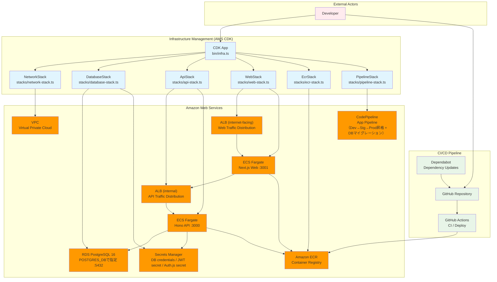
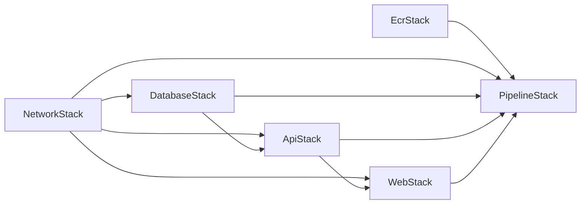
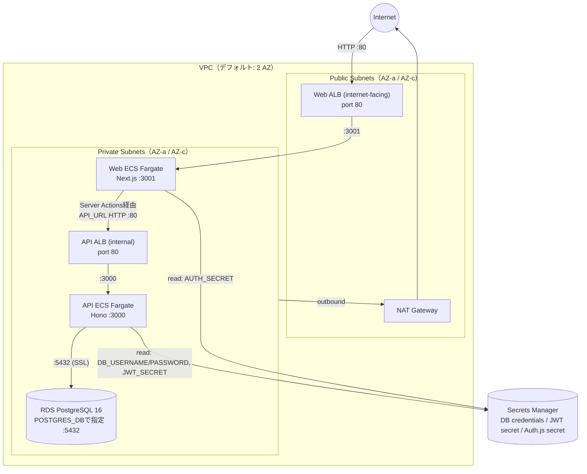
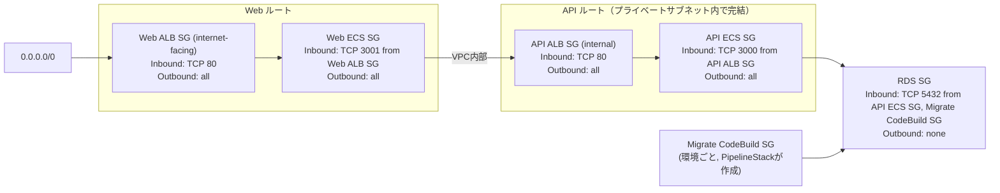
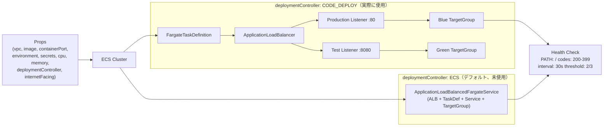

# インフラアーキテクチャ

AWS CDK (TypeScript) で定義。DEV・STG・PROD はそれぞれ**別々の AWS アカウント**にデプロイする。DEV は常に作成され、STG・PROD は `STG_ACCOUNT_ID` / `PROD_ACCOUNT_ID` 環境変数が設定されている場合のみ作成される。

## アカウント構成

- CI/CD パイプライン（`PipelineStack`）とECRは、同じ「**Pipelineアカウント**」に同居する。デフォルト（`PIPELINE_ACCOUNT_ID`未指定）では**DEVアカウントと同居**し、追加設定は不要。`PIPELINE_ACCOUNT_ID`にDEVとは異なるアカウントIDを指定すると、専用のTooling/CI-CDアカウントとして切り出せる（AWSの標準的なマルチアカウント構成に合わせやすくなる一方、切り出す場合はアカウントが1つ増える）
- `cdk synth`/`cdk deploy` は常に Pipeline アカウントの認証情報で実行する。Pipeline アカウントのIDは、`PIPELINE_ACCOUNT_ID`が未指定なら`CDK_DEFAULT_ACCOUNT`（CDK CLIが認証情報から自動セット、＝DEVアカウント）にフォールバックする
- STG・PROD、および（`PIPELINE_ACCOUNT_ID`でPipelineをDEVと別アカウントにした場合の）DEV へは、Pipeline アカウントからの**クロスアカウントデプロイ**になる。それらのデプロイ実行リソース（CodeDeployのDeploymentGroup・Prismaマイグレーション用CodeBuild）は `DeployTargetStack` として各アカウントに作成し、Pipeline アカウントの `PipelineStack` が公開されたIAMロールを引き受けて操作する
- ECR は **Pipeline アカウントに集約**する（DEV/STG/PRODすべてのリポジトリを含む）。Pipeline以外のアカウントからのpullは、リポジトリのリソースポリシー（`AccountPrincipal`）で許可する
- CloudFormation はスタックをまたいだクロスアカウント参照ができないため、Pipelineアカウントとは異なるアカウントのリソース参照はすべて `lib/pipeline-naming.ts` の命名規則からアカウントID・リソース名を逆算し、`fromXxxAttributes` 系メソッドでインポートする方式を取っている
- 実際にPipelineアカウントとは異なるアカウントへデプロイするには、事前に該当アカウントで `cdk bootstrap aws://<ACCOUNT_ID>/<REGION> --trust <Pipelineアカウントのアカウント自体のID>` を実行し、Pipelineアカウントからの信頼を設定しておく必要がある（詳細は [deploy.md](./deploy.md)）

## システム概要


```mermaid
graph TB
    subgraph "External Actors"
        DEV[Developer]
    end

    subgraph "Infrastructure Management (AWS CDK)"
        CDK_APP["CDK App<br/>bin/infra.ts"]
        NETWORK_STACK["NetworkStack<br/>stacks/network-stack.ts"]
        DATABASE_STACK["DatabaseStack<br/>stacks/database-stack.ts"]
        API_STACK["ApiStack<br/>stacks/api-stack.ts"]
        WEB_STACK["WebStack<br/>stacks/web-stack.ts"]
        ECR_STACK["EcrStack<br/>stacks/ecr-stack.ts"]
        PIPELINE_STACK["PipelineStack<br/>stacks/pipeline-stack.ts"]
    end

    subgraph "Amazon Web Services"
        VPC["VPC<br/>Virtual Private Cloud"]
        ALB_API["ALB (internal)<br/>API Traffic Distribution"]
        ALB_WEB["ALB (internet-facing)<br/>Web Traffic Distribution"]
        ECS_API["ECS Fargate<br/>Hono API :3000"]
        ECS_WEB["ECS Fargate<br/>Next.js Web :3001"]
        RDS["RDS PostgreSQL 16<br/>POSTGRES_DBで指定 :5432"]
        ECR["Amazon ECR<br/>Container Registry"]
        SM["Secrets Manager<br/>DB credentials / JWT secret / Auth.js secret"]
        CODEPIPELINE["CodePipeline<br/>App Pipeline（Dev→Stg→Prod昇格 + DBマイグレーション）"]
    end

    subgraph "CI/CD Pipeline"
        GITHUB["GitHub Repository"]
        GITHUB_ACTIONS["GitHub Actions<br/>CI / Deploy"]
        DEPENDABOT["Dependabot<br/>Dependency Updates"]
    end

    %% Development Flow
    DEV --> CDK_APP
    CDK_APP --> NETWORK_STACK
    CDK_APP --> DATABASE_STACK
    CDK_APP --> API_STACK
    CDK_APP --> WEB_STACK
    CDK_APP --> ECR_STACK
    CDK_APP --> PIPELINE_STACK

    %% Infrastructure Resources
    NETWORK_STACK --> VPC
    DATABASE_STACK --> RDS
    DATABASE_STACK --> SM
    API_STACK --> ALB_API
    API_STACK --> ECS_API
    WEB_STACK --> ALB_WEB
    WEB_STACK --> ECS_WEB
    ECR_STACK --> ECR
    PIPELINE_STACK --> CODEPIPELINE

    %% Service Connections
    ALB_API --> ECS_API
    ALB_WEB --> ECS_WEB
    ECS_API --> RDS
    ECS_API --> SM
    ECS_WEB --> ALB_API
    ECS_API --> ECR
    ECS_WEB --> ECR

    %% CI/CD
    DEV --> GITHUB
    GITHUB --> GITHUB_ACTIONS
    GITHUB_ACTIONS --> ECR
    DEPENDABOT --> GITHUB

    %% Styles
    classDef actorClass fill:#ffebee
    classDef infraClass fill:#e1f5fe
    classDef awsClass fill:#ff9900
    classDef ciCdClass fill:#e8f5e8

    class DEV actorClass
    class CDK_APP,NETWORK_STACK,DATABASE_STACK,API_STACK,WEB_STACK,ECR_STACK,PIPELINE_STACK infraClass
    class VPC,ALB_API,ALB_WEB,ECS_API,ECS_WEB,RDS,ECR,SM,CODEPIPELINE awsClass
    class GITHUB,GITHUB_ACTIONS,DEPENDABOT ciCdClass
```

---

## スタック依存関係


```mermaid
graph LR
    NS[NetworkStack] --> DS[DatabaseStack]
    NS --> AS[ApiStack]
    NS --> WS[WebStack]
    DS --> AS
    AS --> WS
    ECR[EcrStack] --> PS[PipelineStack]
    NS --> PS
    DS --> PS
    AS --> PS
    WS --> PS
```

`PipelineStack`（Pipelineアカウント）は、Pipelineと同一アカウントの環境（デフォルトではDEVのみ）についてはBlue/GreenデプロイのためのTargetGroup/Listener（ApiStack・WebStack由来）や、Prismaマイグレーション用CodeBuildを配置するための`NetworkStack`（vpc・rdsSecurityGroup）・`DatabaseStack`（RDSインスタンス・認証情報）に依存する。Pipelineとは別アカウントの環境（STG/PROD、および`PIPELINE_ACCOUNT_ID`指定時のDEV）については同一アカウント内のライブCDK参照が使えないため、`DeployTargetStack`（各環境のアカウント）が代わりにこれらへ依存し、`PipelineStack`側は命名規則から逆算したARN/名前でインポートするだけになる。

| スタック | ファイル | アカウント | 役割 |
|---|---|---|---|
| `EcrStack` | `lib/stacks/ecr-stack.ts` | Pipeline（デフォルトはDEVと同居） | ECR リポジトリ（api / web × 環境、Pipelineアカウントに集約） |
| `PipelineStack` | `lib/stacks/pipeline-stack.ts` | Pipeline（デフォルトはDEVと同居） | GitHub Actions用OIDCロール + アプリCodePipeline（Blue/Greenデプロイ・DBマイグレーション、Pipelineとは別アカウントの環境へはクロスアカウント） |
| `NetworkStack` | `lib/stacks/network-stack.ts` | 環境ごと（DEV/STG/PROD） | VPC・サブネット・セキュリティグループ |
| `DatabaseStack` | `lib/stacks/database-stack.ts` | 環境ごと（DEV/STG/PROD） | RDS PostgreSQL・DB 認証情報 |
| `ApiStack` | `lib/stacks/api-stack.ts` | 環境ごと（DEV/STG/PROD） | Hono API サーバー (ECS Fargate、内部ALB) |
| `WebStack` | `lib/stacks/web-stack.ts` | 環境ごと（DEV/STG/PROD） | Next.js フロントエンド (ECS Fargate、公開ALB) |
| `DeployTargetStack` | `lib/stacks/deploy-target-stack.ts` | Pipelineとは別アカウントの環境（STG/PROD、および`PIPELINE_ACCOUNT_ID`指定時のDEV） | CodeDeployのDeploymentGroup・Prismaマイグレーション用CodeBuild・Pipelineアカウントが引き受けるクロスアカウントIAMロール |

---

## アーキテクチャ全体図


```mermaid
graph TB
    Internet(("Internet"))

    subgraph VPC["VPC（デフォルト: 2 AZ）"]
        subgraph Public["Public Subnets（AZ-a / AZ-c）"]
            NAT["NAT Gateway"]
            WebALB["Web ALB (internet-facing)\nport 80"]
        end

        subgraph Private["Private Subnets（AZ-a / AZ-c）"]
            ApiALB["API ALB (internal)\nport 80"]
            WebECS["Web ECS Fargate\nNext.js  :3001"]
            ApiECS["API ECS Fargate\nHono  :3000"]
            RDS[("RDS PostgreSQL 16\nPOSTGRES_DBで指定  :5432")]
        end
    end

    SM[("Secrets Manager\nDB credentials / JWT secret / Auth.js secret")]

    Internet -->|"HTTP :80"| WebALB
    WebALB -->|":3001"| WebECS
    WebECS -->|"Server Actions経由\nAPI_URL  HTTP :80"| ApiALB
    ApiALB -->|":3000"| ApiECS
    ApiECS -->|":5432 (SSL)"| RDS
    ApiECS -->|"read: DB_USERNAME/PASSWORD, JWT_SECRET"| SM
    WebECS -->|"read: AUTH_SECRET"| SM
    Private -->|"outbound"| NAT
    NAT --> Internet
```

ブラウザは常にWeb ALBのみと通信する（Next.jsのServer Actions + Honoの型付きRPCクライアントによるBFF構成）。API ALBはブラウザから直接到達できない内部ALBで、Webタスクからのみアクセスされる。

---

## セキュリティグループ

ALB・ECS のセキュリティグループは `EcsFargateService` コンストラクトが自動生成する（`internetFacing: false` の場合、API ALBはプライベートサブネットに配置されるためインターネットから到達不可）。
RDS セキュリティグループは `NetworkStack` で定義し、`ApiStack` 内で `CfnSecurityGroupIngress` を使って API ECS SG からのインバウンドルールを追加している。加えて、`PipelineStack` がPrismaマイグレーション用CodeBuild（環境ごとに専用SG）からのインバウンドルールも同様のパターンで追加している。


```mermaid
flowchart LR
    Internet["0.0.0.0/0"]

    subgraph WebRoute["Web ルート"]
        WebALB_SG["Web ALB SG (internet-facing)\nInbound: TCP 80\nOutbound: all"]
        WebECS_SG["Web ECS SG\nInbound: TCP 3001 from Web ALB SG\nOutbound: all"]
    end

    subgraph ApiRoute["API ルート（プライベートサブネット内で完結）"]
        ApiALB_SG["API ALB SG (internal)\nInbound: TCP 80\nOutbound: all"]
        ApiECS_SG["API ECS SG\nInbound: TCP 3000 from API ALB SG\nOutbound: all"]
    end

    MigrateSG["Migrate CodeBuild SG\n(環境ごと, PipelineStackが作成)"]
    RDS_SG["RDS SG\nInbound: TCP 5432 from API ECS SG, Migrate CodeBuild SG\nOutbound: none"]

    Internet --> WebALB_SG --> WebECS_SG
    WebECS_SG -->|"VPC内部"| ApiALB_SG --> ApiECS_SG
    ApiECS_SG --> RDS_SG
    MigrateSG --> RDS_SG
```

---

## スタック詳細

### EcrStack

環境ごとに api / web の ECR リポジトリペアを管理する、Pipelineアカウント（デフォルトはDEVと同居）のスタック。DEV は常に作成され、STG・PROD は対応するアカウントIDが指定されている場合のみ作成する。

| 項目 | 値 |
|---|---|
| リポジトリ名 | `forge-ts/api-{env}` / `forge-ts/web-{env}` |
| イメージスキャン | プッシュ時に自動実行（`imageScanOnPush: true`） |
| ライフサイクルルール | 最新 20 イメージのみ保持 |
| 削除ポリシー | `RETAIN`（スタック削除時もリポジトリは残る） |

| 環境 | 作成条件 |
|---|---|
| DEV | 常時 |
| STG | `STG_ACCOUNT_ID` 環境変数が設定されている場合のみ |
| PROD | `PROD_ACCOUNT_ID` 環境変数が設定されている場合のみ |

DEV（`PIPELINE_ACCOUNT_ID`でPipelineをDEVと別アカウントにした場合のみ）・STG/PRODリポジトリには、対応するアカウント（`AccountPrincipal`）からの`ecr:BatchGetImage`等のpullを許可するリソースポリシーが自動付与される。各アカウント側のECSタスク実行ロールはIAM側の権限（`AmazonECSTaskExecutionRolePolicy`）を既に持っているため、これだけでクロスアカウントpullが成立する。

### PipelineStack

Pipelineアカウント（デフォルトはDEVと同居）のスタック。役割は大きく2つ。

1. **GitHub Actions用のOIDCロール**（IAMのみ、CodePipelineとは無関係）
   | ロール | 用途 | スコープ |
   |---|---|---|
   | `github-actions-app-deploy` | DEV ECRへのイメージpush専用 | `refs/heads/main` |
   | `github-actions-infra-deploy` | `cdk deploy`（`main` Environment承認必須）。Pipelineアカウント自身の`cdk-*`ブートストラップロールに加え、DEV（`PIPELINE_ACCOUNT_ID`指定時）・`STG_ACCOUNT_ID`/`PROD_ACCOUNT_ID`が設定されていればそれぞれの`cdk-*`ロールもAssumeRole対象に含まれる | GitHub Environment `main` |

2. **アプリ用CodePipeline**（`ApiAppPipeline` / `WebAppPipeline`）
   - **Source**: GitHubではなく、DEV ECRリポジトリ（Pipelineアカウント内）への`:latest`イメージpushをEventBridge経由で検知して起動（`EcrSourceAction`）。ECRは常にPipelineアカウントに集約されるため、このステージ自体はDEVがクロスアカウントの場合でも常にPipelineアカウント内で完結する
   - **Generate → (Migrate) → Deploy** の順にステージが並ぶ。`Migrate*`（`MigrateDev`/`MigrateStg`/`MigrateProd`）は`ApiAppPipeline`のみに存在し、VPC内に配置したCodeBuildで`prisma migrate deploy`を実行してからBlue/Greenデプロイに進む
   - `Generate*`ステージは、ECSサービスが現在使用中のタスク定義ではなく、**`cdk deploy`のたびに最新化されるタスク定義のfamily名**（revision省略で最新ACTIVEを取得、例: `stg-api`）を起点にコンテナイメージだけを差し替える（`CODE_DEPLOY`コントローラーのECSサービスはタスク定義の更新をCloudFormationだけでは反映しないため）。対象環境がPipelineとは別アカウントの場合はbuildspec内で`sts assume-role`によりクロスアカウントロールを引き受けてから`ecs describe-task-definition`を呼ぶ
   - DEV→STG→PRODの昇格は再ビルドではなくECRイメージダイジェストのコピー（`buildPromoteProject`、ECRが常にPipelineアカウントに集約されているため常に同一アカウント内で完結）。承認ゲートは`ApproveStg`/`ApproveProd`（`ManualApprovalAction`）
   - `Migrate*`・`Deploy*`アクションのうち対象環境がPipelineとは別アカウントのもの（STG/PROD、および`PIPELINE_ACCOUNT_ID`指定時のDEV）は、`DeployTargetStack`（各環境のアカウント）が公開する`pipeline-cross-account-{dev|stg|prod}`ロールを`role`propに渡すことでクロスアカウント実行する（CodePipelineネイティブのクロスアカウントアクション機構）。アーティファクトS3バケットは、いずれかの環境がPipelineとは別アカウントの場合`crossAccountKeys: true`でカスタマー管理KMSキーを使用し、このロールに読み取り・復号権限を付与する

### DeployTargetStack

`STG_ACCOUNT_ID` / `PROD_ACCOUNT_ID`（および`PIPELINE_ACCOUNT_ID`でPipelineをDEVと別アカウントにした場合のDEV）が該当する場合のみ、それぞれのアカウントに作成されるスタック。Pipelineアカウントのパイプラインからは対象環境のアカウントに対してCloudFormationのクロスアカウント参照ができないため、デプロイ実行に必要なリソースをアカウントローカルに用意し、`lib/pipeline-naming.ts`の命名規則から逆算できる名前・ARNで公開する。

| リソース | 用途 |
|---|---|
| CodeDeploy Application/DeploymentGroup（Api/Web） | Blue/Greenデプロイの実行先。`ApiStg`/`ApiStgDeploymentGroup`のように命名規則で固定した名前を持つ |
| Prismaマイグレーション用CodeBuild（Api/Web） | RDSと同じVPCに配置（Pipelineアカウントに置いたCodeBuildはアカウントを跨いでVPCへ到達できないため） |
| `pipeline-cross-account-{env}` IAMロール | Pipelineアカウント（`AccountPrincipal`）のみが引き受け可能。CodeDeploy操作・CodeBuild起動・ECSタスク定義参照の権限を持つ |

ECRイメージのpullに必要な権限は、Pipelineアカウントに集約されたECRリポジトリ側のリソースポリシー（`EcrStack`）で許可されるため、このスタック側では追加のECR設定は不要（IAM側の`ecr:BatchGetImage`等の許可のみ付与）。

### NetworkStack

- **VPC**: パブリック・プライベートサブネット各 AZ、NAT Gateway 1 台
- セキュリティグループを 3 つ定義し、下位スタックへ渡す
- **VPC エンドポイント**: S3（Gateway型、全環境）は常時作成。ECR（API/Docker）・Secrets Manager・CloudWatch Logs（Interface型）は `enableVpcEndpoints` が `true` の場合のみ作成される。`bin/infra.ts` は DEV では `false`、STG/PROD では `true` を指定しており（NAT Gateway経由の通信で足りるDEVはコスト優先、STG/PRODはAWS内部通信に限定）、環境変数での上書きはできない

| セキュリティグループ | インバウンド | アウトバウンド |
|---|---|---|
| `albSecurityGroup` | TCP 80, 443 (0.0.0.0/0) | all |
| `ecsSecurityGroup` | TCP 3000 from ALB SG | all |
| `rdsSecurityGroup` | TCP 5432 from ECS SG | なし |

> `albSecurityGroup` / `ecsSecurityGroup` は現在 NetworkStack のみで定義されており、各スタックの ECS サービスには実際には適用されていない（`EcsFargateService` コンストラクトが `deploymentController: CODE_DEPLOY` の場合、ALB・サービスを手動構築しSGも自動生成するため）。`rdsSecurityGroup` は DatabaseStack・ApiStack・PipelineStack（マイグレーション用CodeBuild）に渡され実際に使われる。

### DatabaseStack

- RDS PostgreSQL 16 をプライベートサブネットに配置
- DB 認証情報は Secrets Manager (`DatabaseSecret`) に自動保存
- `rdsSecurityGroup` を RDS インスタンスに適用

| 項目 | 値 |
|---|---|
| DB 名 | 環境変数 `POSTGRES_DB` で指定（必須、デフォルト値なし） |
| ユーザー | `postgres` |
| ストレージ | 20 GB（最大 100 GB まで自動スケール） |
| Multi-AZ | 無効 |

### ApiStack

- `EcsFargateService` コンストラクト（`lib/constructs/ecs-fargate-service.ts`）を利用して ALB + Fargate を構築（`deploymentController: CODE_DEPLOY` のためBlue/Green構成、詳細は [再利用コンストラクト](#再利用コンストラクト-ecsfargateservice) を参照）
- `internetFacing` はデフォルト `false`（内部ALB）。ブラウザはAPIに直接アクセスせず、Webのサーバー側（Server Actions）からのみ呼び出される
- RDS 接続情報と JWT シークレットを Secrets Manager から起動時に注入
- Prisma（`@prisma/adapter-pg`）はRDSの暗号化接続要件に合わせ、`NODE_ENV=production` 時のみ `ssl: { rejectUnauthorized: false }` を有効化
- `CfnSecurityGroupIngress` で API ECS SG → RDS SG (:5432) のインバウンドルールを追加
- タスクロールに DB 認証情報・JWT シークレットの `secretsmanager:GetSecretValue` を付与
- グローバルな `app.onError()` で未捕捉の例外をログ出力してから500を返す（Honoのデフォルト動作は例外を握りつぶすため）

```
環境変数: DB_HOST, DB_PORT, DB_NAME, NODE_ENV
シークレット: DB_USERNAME, DB_PASSWORD (DatabaseSecret), JWT_SECRET (jwt-secret)
```

### WebStack

- `EcsFargateService` コンストラクトを利用して ALB + Fargate を構築（`internetFacing` はデフォルト `true`、唯一のブラウザからの入口）
- `API_URL` には ApiStack の ALB DNS 名を渡す（デプロイ時に動的解決）。Next.jsのServer Actions（Honoの型付きRPCクライアント `hc<AppType>()`）がサーバー側からこのURLでAPIを呼び出す。ブラウザは常にWebのみと通信し、APIへ直接アクセスしない
- `AUTH_URL` には自分自身（WebService）のALB DNS名を渡す（Auth.jsが`trustHost`によるHostヘッダー推測でECSタスクの内部ホスト名を使ってしまう問題を避けるため、明示的に指定）
- `AUTH_SECRET` はSecrets Managerからシークレットとして注入（Auth.jsのセッション暗号化用）

```
環境変数: API_URL (http://<API ALB DNS>), AUTH_URL (http://<Web ALB DNS>), NODE_ENV
シークレット: AUTH_SECRET (Secrets Manager: {env}/auth-secret)
```

---

## 再利用コンストラクト: EcsFargateService

`lib/constructs/ecs-fargate-service.ts` — ApiStack・WebStack で共通利用する ALB + ECS Fargate のコンストラクト。`deploymentController` の値で構築方法が分岐する。`bin/infra.ts` は ApiStack・WebStack いずれも常に `CODE_DEPLOY` を指定するため、**実際にデプロイされるのは常に Blue/Green（CodeDeploy）側**であり、`ECS`（デフォルト）側の `ApplicationLoadBalancedFargateService` パスは現状使われていない。


```mermaid
graph LR
    Props["Props\n(vpc, image, containerPort,\nenvironment, secrets, cpu, memory,\ndeploymentController, internetFacing)"]
    Cluster["ECS Cluster"]

    subgraph CodeDeployBranch["deploymentController: CODE_DEPLOY（実際に使用）"]
        TaskDef["FargateTaskDefinition"]
        ALB["ApplicationLoadBalancer"]
        ProdListener["Production Listener :80"] --> BlueTG["Blue TargetGroup"]
        TestListener["Test Listener :8080"] --> GreenTG["Green TargetGroup"]
    end

    subgraph EcsBranch["deploymentController: ECS（デフォルト、未使用）"]
        AlbFs["ApplicationLoadBalancedFargateService\n(ALB + TaskDef + Service + TargetGroup)"]
    end

    HC["Health Check\nPATH: /  codes: 200-399\ninterval: 30s  threshold: 2/3"]

    Props --> Cluster
    Cluster --> TaskDef --> ALB
    ALB --> ProdListener
    ALB --> TestListener
    Cluster --> AlbFs
    BlueTG --> HC
    AlbFs --> HC
```

Blue/Green側は `PipelineStack` の `CodeDeployEcsDeployAction` が本番トラフィック（Production Listener）を段階的にGreenへ切り替え、Test Listener（:8080）で新タスクの事前検証を行う。

---

## 設定パラメータ

### アカウント関連

| 環境変数 | デフォルト | 説明 |
|---|---|---|
| `CDK_DEFAULT_ACCOUNT` | なし | DEVアカウントのID。cdk実行時の認証情報からCDK CLIが自動セットするため、明示指定は不要 |
| `CDK_DEFAULT_REGION` | なし | 全アカウント共通のリージョン。`STG_ACCOUNT_ID`/`PROD_ACCOUNT_ID`/`PIPELINE_ACCOUNT_ID`（DEVと異なる場合）設定時は必須（未設定だと`cdk synth`/`deploy`がエラーで停止する） |
| `PIPELINE_ACCOUNT_ID` | `CDK_DEFAULT_ACCOUNT`（＝DEVと同居） | Pipeline（`PipelineStack`・`EcrStack`）を配置するアカウントのID。DEVと異なる値を指定した場合のみDEVもクロスアカウントターゲット（`DevDeployTargetStack`）として扱われる |
| `STG_ACCOUNT_ID` | なし | STGアカウントのID。設定されている場合のみSTG関連スタック（`StgNetworkStack`等・`StgDeployTargetStack`）が作成される |
| `PROD_ACCOUNT_ID` | なし | PRODアカウントのID。設定されている場合のみPROD関連スタックが作成される |

### 環境ごとのリソース設定

`bin/infra.ts` の `createEnvInfra()` が読み取る。ほとんどが環境ごとに `DEV_` / `STG_` / `PROD_` を接頭辞として付けた環境変数（`${E}_XXX`）で、環境ごとに個別上書きできる。`POSTGRES_DB` のみ接頭辞なしの共通変数で、必須（未設定だと `cdk synth`/`deploy` がエラーで停止する）。

| 環境変数 | デフォルト | 説明 |
|---|---|---|
| `POSTGRES_DB` | なし（必須） | RDSのデータベース名。全環境共通の1変数（環境ごとの接頭辞なし） |
| `{ENV}_DB_INSTANCE_TYPE` | `t3.micro` | RDS インスタンスタイプ |
| `{ENV}_DB_ALLOCATED_STORAGE` | `20` | 初期ストレージ (GB) |
| `{ENV}_DB_MAX_ALLOCATED_STORAGE` | `100` | 自動スケール上限 (GB) |
| `{ENV}_API_CPU` | `256` | API タスクの CPU ユニット |
| `{ENV}_API_MEMORY_MIB` | `512` | API タスクのメモリ (MiB) |
| `{ENV}_API_DESIRED_COUNT` | `1` | API タスクの起動数 |
| `{ENV}_WEB_CPU` | `256` | Web タスクの CPU ユニット |
| `{ENV}_WEB_MEMORY_MIB` | `512` | Web タスクのメモリ (MiB) |
| `{ENV}_WEB_DESIRED_COUNT` | `1` | Web タスクの起動数 |

`{ENV}` は `DEV` / `STG` / `PROD`（例: `DEV_API_CPU`, `STG_DB_INSTANCE_TYPE`）。`STG_ACCOUNT_ID`/`PROD_ACCOUNT_ID`が設定されている環境のみ意味を持つ。

NetworkStackのAZ数（デフォルト2）は環境変数化されておらず、`NetworkStack` のコンストラクタ引数（現状 `bin/infra.ts` からは未指定でコンストラクト側デフォルトを使用）でのみ変更可能。
